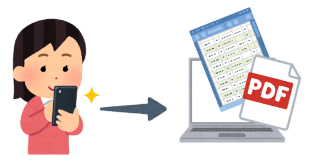
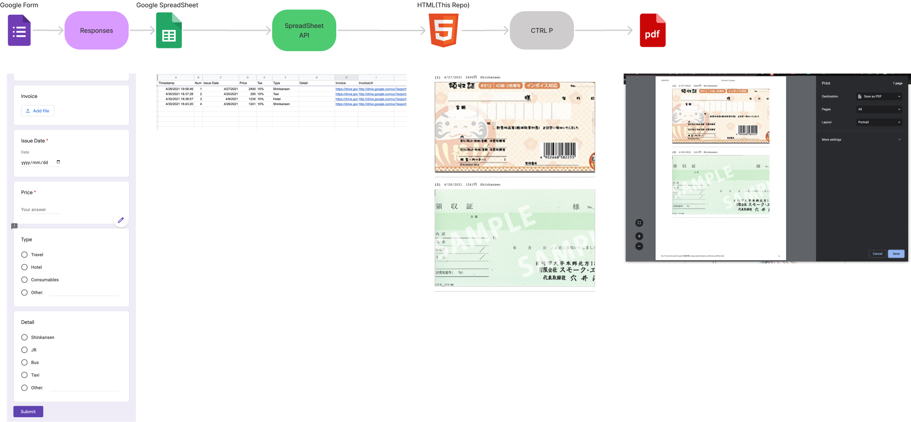

# Google Api changed (working on patch)
---
# Japanese-receipt-collector
Collect recepits while with your mobile, and print it out via PDF 

## Set-up Manual

1. Creat a Google Form
2. Link to a Google spreadsheet ([link](https://docs.google.com/spreadsheets/d/1XLFHgxnbKCfzPA46Ikxkbpo0mF0t0gC4XUSYsYOpcWA/edit?usp=sharing))
3. Publish Google Spreadsheet to Web
4. Copy Spreadsheet ID to ryoshusyo.html
5. Open ryoshusyo.html 
6. Ctrl P to Prink the page
